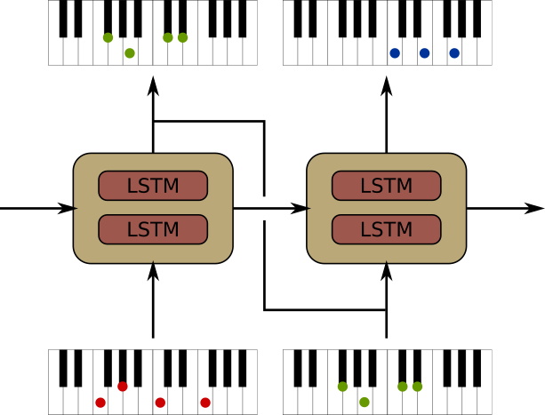
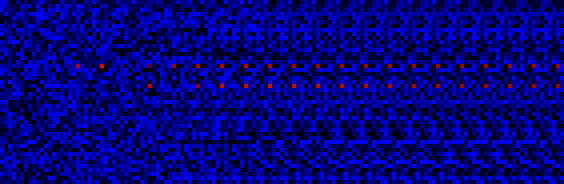
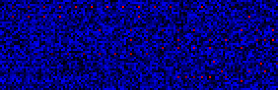
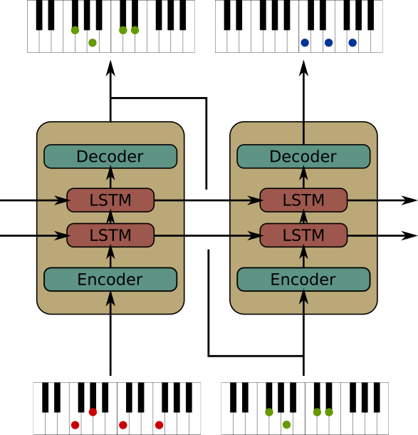

# Models

Here are presented my experiments and the models I used.

## Basic RNN

As baseline, I tried a simple RNN model (2 LSTM layers). Given a keyboard configuration, the network tries to predict the next one (this architecture is similar to the famous [Char-RNN](https://github.com/karpathy/char-rnn) model, used to generate English sentences). I formulate the prediction as a 88-binary classification problems: for each note on the keyboard, the network try to guess if the note is pressed or released. Because all classifications are not mutually exclusive (two keys can be pressed at the same time), I use a sigmoid cross entropy instead of softmax. For this first try, a lot of assumptions have been made on the song (only 4/4 for signature, quarter-note as maximum note resolution, no tempo changes or other difficulties that the model could not handle).

*Base RNN structure. The network generate a sequence of keyboard configuration.*

At first, I try to trained this model on 3 Scott Joplin songs. I choose Ragtime music for the first test because Ragtime songs have a really rigid and well defined structure, and the songs satisfied the assumptions made above. Each song is slitted in small parts and I randomly shuffle the parts between the songs so the network learn simultaneously different songs.

Because there is a high bias toward the negative class (key not pressed), I was a little afraid that the network would only predict empty songs. It doesn't seems to be the case. On the contrary, the network clearly overfit. When analysing the generated song, we see that the network has memorized entire parts of the original songs. This simple model was mainly a test to validate the fact that a small/medium sized network can encode some rhythmic and harmonic information. Of course, the database wasn't big enough to have a truly original artificial composer, but I'm quite impress by the capability of the network to learn by heart the song (blessed be the LSTM).

Usually the first notes are quite randoms but after few bars, the network stabilize over a part of the song he remember. When trying to generate sequences longer than the training ones, the network will simply loop over some parts and play it indefinitely. You can listen one of the generated song [here](https://soundcloud.com/reivalk/basic-rnn-joplin-example-overfitting?in=reivalk/sets/music-generator-experiments). We can clearly recognize parts of [Rag Dance](https://youtu.be/tCrj1s1iVas).

 

*Piano rolls of the predictions. During the first iterations, the networks only predict very repetitive patterns. When training longer, the patterns become more complex*

I then applied this model on a larger dataset (400+ songs). Here are some samples of generated songs with this model:
* [Sample 1](https://soundcloud.com/reivalk/basic-rnn-ragtime-1?in=reivalk/sets/music-generator-experiments)
* [Sample 2](https://soundcloud.com/reivalk/basic-rnn-ragtime-2?in=reivalk/sets/music-generator-experiments)

The originals generated midi files can be found in [this folder](midi/). I convert them to mp3 using the utility script present in the root directory.

There are some problems with this model. One being that even if trained conjointly, the predictions are done independently. Each one of the 88 classifier do not concert the other ones before doing its prediction so for instance the network's part which predict if a E4 should be played has no way to know if G2 is predicted at the same time or not (one way to solve this issue could be to use CRF). Similarly, the neural network don't care about the relative order of the notes in the input vector. We could invert the keys on the keyboard and the prediction would be the same. To improve our model, the model should have a way to know that the interval between C4 and C4# is the same that the one between A3 and A3#. There are some architecture which could be worth exploring.

One other problem, maybe a little more technical. When the network see a new sequence, it start from a clear memory, like it had never seen anything before and will progressively build and encode what it 'sees' to its internal state. It's impossible for the network to correctly guess the first notes, when internal state is empty (as it is reset at each iteration), so during the first timestep the network has no knowledge on the song it his suppose to predict. A way this issue has been solved on some other model is to use another network called encoder which basically will compute the internal state to give at the network for its first step. Here, using a separate network for the encoding would be cheating, because to generate new songs, we don't want our model to rely on an encoder which would have "prepared" the song to play. The solution I tried is simply to ignore the first prediction (the first steps are just here so the network can encode tonality, rhythm,...) and gradually penalize the mistakes more and more as we progress through the steps. Basically what this change do is telling the network that it's less important to make a mistake during the first timestep when the structure of the song is completely unknown that at the end when it should have integrated the rhythm, tonality,... It's somehow similar to the encoder/decoder architecture, but using a single network for both.

## EnDeCell

In order to solve some of those issues, I tried to develop a more audacious architecture. One of the most important thing in music the spacial relationship/distance between the different notes, so the model should somehow capture that relation. In order to integrate those information, I add a system of encoder/decoder block which will do exactly that. Because music is made of different regular patterns (major chords, minor chords,...), those could potentially be compressed and encapsulated in the encoder output. The role of the encoder is to count the distance between the notes and compress that information into a single state vector. The decoder on the other end does exactly the opposite, generate a keyboard configuration from a state vector. Another way to see it, what I try to create is some kind of embedding for the keyboards configurations, where each keyboard configuration would be projected on a vector space which would represent the 'semantic' of the keyboard. The LSTMs goal would be to links those configurations together.

Potentially any kind of network could fit inside the enco/deco blocks. A simple CNN for instance could potentially learn filters which could represent chords, but because CNN learn translation invariant filter, we would loose the chord position information. I chose instead two RNNs for encoding/decoding the network similar as the original seq2seq model, which would read the keyboard note by note.

*The architecture of the EnDeCell RNN. Each cell contain an encoder/decoder block. Each enco/deco block contain a RNN which capture the keyboard state.*

Because of the complexity of the model (network inside network) and to simplify the training, it should be possible to first train the encoder/decoder separately on some keyboard configuration samples and then integrate the weights into the complete model.

I had big ambitions for this model, and a lot of variant to test. But after some preliminary test, I must face the reality that I simply don't have the hardware to train it. Indeed the number of recurrent step is simply too big to handle (nb_song_time_step*nb_notes*2 per iteration). However, I keep this model in my head for the day where computational power will be more affordable.

Some solution to make this model computationally more efficient and to reduce the RNN length could be to make it predict multiple song time steps at once (ex: predicting the next bar from the previous one), or for the encoder to encode multiple keys at once.
